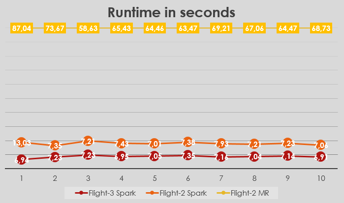

# bigdata-projects
Student projects in Big Data field, during my studies at Budapest University of Technology and Economics (BME).
All the projects were homework assignments, and they were implemented by me.

Comments and suggestions are warmly welcome.

# Projects
## Flight data analysis

### Task

Flight records in USA are stored and some of them are made available for research purposes at [Statistical Computing](http://stat-computing.org/dataexpo/2009/the-data.html). The data are separated by year from 1987 to 2008. The attributes include the common properties a flight record have (e.g. date, origin and destination airports, air time, scheduled and actual departure and arrival times, etc).

During a practical course called 'Big Data Analytics Tools with Open-Source Platforms' at BME we had a homework assignment which contained two questions. The questions had to be answered by implementing a data analysis chain, that retrieves the neccesary information from the input files. We could use several technologies from the Hadoop Framework. I used Spark and native Java MapReduce.

We had to work with the dataset of year 2008.

### Question #1

*From which airport took most of the airplanes off?*

### Answer #1

*ATL, 408683 times*

According to the dataset of year 2008.

I used Spark and Java MapReduce to answer the question. The Spark solution is avaiable [here](https://github.com/benedekh/bigdata-projects/tree/master/hu.bme.bigdata.homework.spark.flight2/), while the Java MapReduce solution is available [here](https://github.com/benedekh/bigdata-projects/tree/master/hu.bme.bigdata.homework.mapreduce.flight2/).

#### Spark

You should use Spark 1.5.1. for Hadoop 2.6. I downloaded a pre-built version [here](http://spark.apache.org/downloads.html), and I used Spark in a standanlone mode, without Hadoop.

To compile the source code of the implementation, you should use Maven:

```bash
cd hu.bme.bigdata.homework.spark.flight2

mvn clean

mvn install
```

The compiled jar (spark.flight2-0.0.1-SNAPSHOT.jar) is available in the *target* folder. To run the solution, you should either download a csv from [Statistical Computing](http://stat-computing.org/dataexpo/2009/the-data.html) or switch to the *datasets* branch of this repository, and download the *2008.csv*.

To run from the command line:

```bash
cd target

java -jar spark.flight2-0.0.1-SNAPSHOT.jar --home <Spark installation directory> --data <2008.csv path> --partitions <number of partitions>
```

The parameters are self explaining, though the partitions parameter should be set for the number of cores, your computer CPU has (use *--partitions 1*, if you are not sure how many cores your CPU has).


#### Java MapReduce

I used *Cloudera QuickStart 5.4.2.0* virtual machine image for VirtualBox, you can downloaded it [here](http://www.cloudera.com/content/www/en-us/downloads/quickstart_vms/5-4.html). I used the local Hadoop cluster offered by the image, via the cloudera web console. I uploaded the data file (2008.csv) to the HDFS.

To compile the source code of the homework assignment:

```bash
cd hu.bme.bigdata.homework.mapreduce.flight2

javac -cp /usr/lib/hadoop/*:/usr/lib/hadoop-mapreduce/* hu/bme/bigdata/homework/mapreduce/flight2/*.java hu/bme/bigdata/homework/mapreduce/flight2/mappers/*.java hu/bme/bigdata/homework/mapreduce/flight2/reducers/*.java -d build -Xlint

jar -cvf demo.jar -C build/ .
```

The *demo.jar* is the compiled jar, that should be run on hadoop.

```bash
hadoop jar demo.jar hu.bme.bigdata.homework.mapreduce.flight2.MapReduceApplication <2008.csv path on HDFS> <output folder path on HDFS>
```

The output of the script is at *[output folder path on HDFS]-result* folder (pay attention to the *-result* prefix).


### Question #2

*In winter or summer are more planes delayed by proportion?*

Winter is between 1st November and 7th March. Other dates belong to summer.

### Answer #2

|SEASON|NUMBER OF DELAYS|NUMBER OF RECORDS|
|--------|------------------|-------------------|
|SUMMER|1894499|4554528|
|WINTER|1085005|2317766|

*In average, in WINTER 0.05% more of the planes are delayed than in SUMMER.*

According to the dataset of year 2008.

I used Spark to answer the question. The Spark solution is avaiable [here](https://github.com/benedekh/bigdata-projects/tree/master/hu.bme.bigdata.homework.spark.flight3/).

#### Spark

You should use Spark 1.5.1. for Hadoop 2.6. I downloaded a pre-built version [here](http://spark.apache.org/downloads.html), and I used Spark in a standanlone mode, without Hadoop.

To compile the source code of the implementation, you should use Maven:

```bash
cd hu.bme.bigdata.homework.spark.flight3

mvn clean

mvn install
```

The compiled jar (spark.flight3-0.0.1-SNAPSHOT.jar) is available in the *target* folder. To run the solution, you should either download a csv from [Statistical Computing](http://stat-computing.org/dataexpo/2009/the-data.html) or switch to the *datasets* branch of this repository, and download the *2008.csv*.

To run from the command line:

```bash
cd target

java -jar spark.flight3-0.0.1-SNAPSHOT.jar --home <Spark installation directory> --data <2008.csv path> --partitions <number of partitions>
```

The parameters are self explaining, though the partitions parameter should be set for the number of cores, your computer CPU has (use *--partitions 1*, if you are not sure how many cores your CPU has).


### Benchmark

I benchmarked the two Spark solutions for the questions, and the Java MapReduce implementation for the first question.

The benchmarking was done on a computer containing Intel Core i7-4700MQ @ 2.4GHz CPU, 8 GB RAM. 

Spark was run on a VirtualBox virtual machine using 4 CPU cores and 5 GB RAM. The Spark implementations of assigments were run using 4 partitions as a parameter. The Spark solution of the 1st assigment is called **Flight2-Spark**, the 2nd assignment is called **Flight3-Spark** on the figure.

Java MapReduce was run on the Cloudera VM using 4 CPU cores and 5 GB RAM. The Java MapReduce solution of the 1st assigment is called **Flight2-MR** on the figure.

[](images/benchmark.png)

